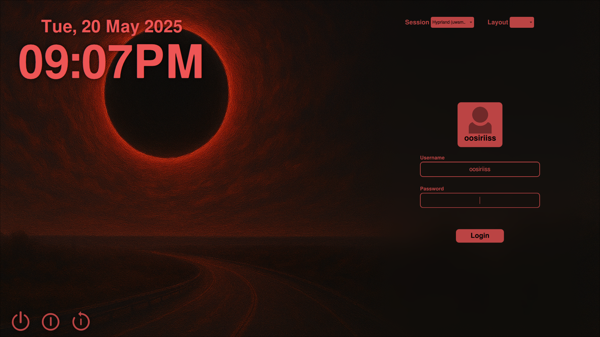

# SDDM Eclipse Theme 

## Sample




## Description

This was my first time with QML and SDDM theming. Therefore I can't guarantee perfect quality, although I didn't encounter any issues.
It was developed for my Arch Linux setup on a 1920x1080 screen. Other screen sizes were not tested.


- Test Configuration with ```sddm-greeter-qt6 --test-mode --theme <THEME>```
- SDDM theming docs: https://github.com/sddm/sddm/blob/develop/docs/THEMING.md

## Installation

1. Clone the repository
```git clone https://github.com/oosiriiss/sddm-eclipse-theme```
2. Copy it to SDDM themes directory
```sudo cp -r sddm-eclipse-theme /usr/share/sddm/themes/eclipse```
3. Create config in ```/etc/sddm.conf.d/<your_theme_name>.conf```. The default config file  is located in ```/usr/lib/sddm/sddm.conf.d```
> [!IMPORTANT]
> Make sure to set the current theme with the name of the theme in ```/usr/share/sddm/themes/```(eclipse)
4. Set ```Current=eclipse``` under **[Theme]** section.

## Troubleshooting
- If the background image is not displayed properly make sure it has the right permissions
